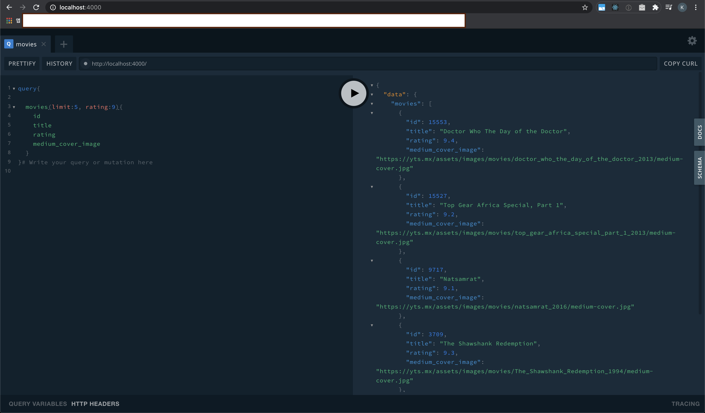

# movieql

movie API with GraphQL

# Proejct Setup

## yarn init

```
brew install yarn
yarn init
```

> result : package.json

## connect repo. from github(git command)

```
git init
git remote add origin https://github.com/SteveKim0513/movieql
git pull origin master
```

## graphql-yoga : easy setup

- https://github.com/prisma-labs/graphql-yoga

```
yarn add graphql-yoga
```

- install nodemon(restart server when you change code file) & babel

```
yarn global add nodemon
yarn global add babel-cli
```

- make .babelrc file

```
//.babelrc file
{
  "presets": ["env", "stage-3"]
}
```

```
yarn add babel-cli babel-preset-env babel-preset-stage-3 --dev
```

# Solve two problems with GraphQL

- Over-fetching : 사용자가 원하는 것 이상의 정보를 서버에 요청한다.
- Under-fetching : REST API 하나를 완성하기 위해 서버를 여러번 호출한다.

# movie info. from REST API

- install [node-fetch](https://github.com/node-fetch/node-fetch)

```
yarn add node-fetch
```

- [yts REST API](https://yts.mx/api#list_movies)
  > <참고> Chrome extention 중 jsonview 설치하면 브라우저에서 json beautify 적용되어 보여짐
  > <참고> fetch API 설명 : https://opentutorials.org/course/3281/20562

# Start Server

```
yarn start
```

- URL : localhost:4000

# Result


